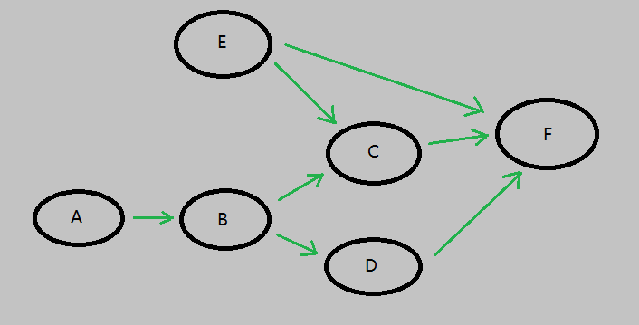
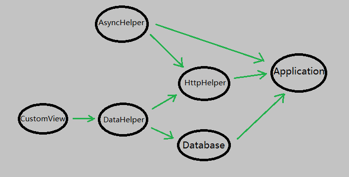
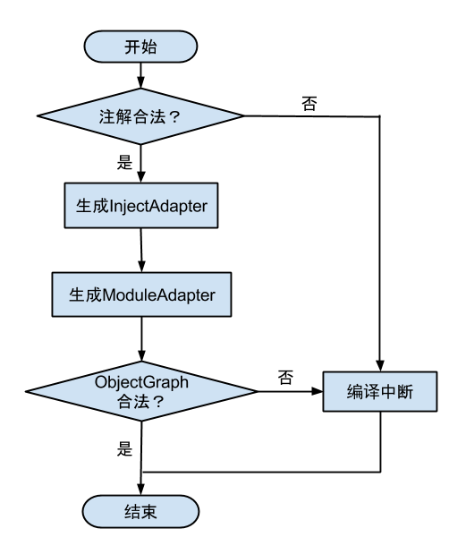
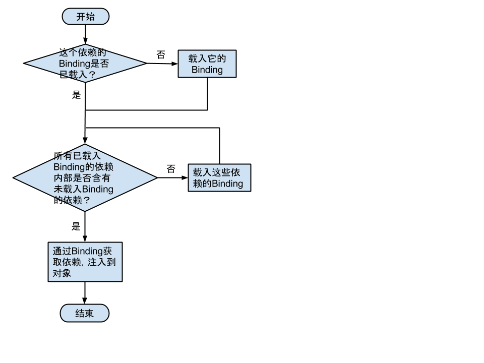

Dagger 实现原理解析
====================================
> 本文为 [Android 开源项目实现原理解析](https://github.com/android-cn/android-open-project-analysis) 中 Dagger 部分  
> 项目地址：[Dagger](https://github.com/square/dagger)，分析的版本：[2f9579c](https://github.com/square/dagger/commit/2f9579c48e887ffa316f329c12c2fa2abbec27b1 "Commit id is ${2f9579c48e887ffa316f329c12c2fa2abbec27b1}")，Demo 地址：[Dagger Demo](https://github.com/android-cn/android-open-project-demo/tree/master/dagger-demo)    
> 分析者：[扔物线](https://github.com/rengwuxian)，校对者：[Trinea](https://github.com/trinea)，校对状态：未完成   

###1. 功能介绍  

Dagger是一款Java平台的依赖注入库（如果你还不了解依赖注入，务必先看[这篇文章](https://github.com/android-cn/blog/tree/master/java/dependency-injection)）。Java的依赖注入库中，最有名的应该属Google的Guice。Guice的功能非常强大，但它是通过在运行时读取注解来完成依赖的注入的，注解的读取需要依靠Java的反射机制，这对于对运行时性能非常敏感的Android来说是一个硬伤。基于此，Dagger应运而生。Dagger同样使用注解来实现依赖注入，不过由于原理的不同（Dagger运用APT在编译时生成了辅助代码，在运行时使用，Dagger对于程序的性能影响非常小，因此更加适用于Android应用的开发。

再次声明，如果你还不了解依赖注入，务必先看[这篇文章](https://github.com/android-cn/blog/tree/master/java/dependency-injection)。

####1.1 基本使用

本文将以一个简单的“老板和程序员”App为例。

你想把一个Boss对象注入到一个Activity中，那么首先你要告诉程序一个Boss对象应该怎样被生成。在Boss类的构造方法前添加一个@Inject注解，Dagger就会在需要的时候获取Boss对象的时候，调用这个被标记的构造方法，从而获取一个Boss对象。

```java
public class Boss {
    ...

    @Inject
    public Boss() {
        ...
    }

    ...
}
```

_需要注意的是，如果构造函数含有参数，Dagger会在构造对象的时候先去获取这些参数（不然谁来传参？），所以你要保证它的参数也能被Dagger获取到。（Dagger获取对象的方式有两种：除了注解构造方法之外，也可以通过提供相应的@Provides注解方法来获取，下面会讲到）_

通过@Inject注解了构造方法之后，在Activity中的Boss对象声明之前也添加@Inject注解。像这种在成员变量前的@Inject注解的目的是告诉Dagger哪些成员变量需要被注入。

```java
public class MainActivity extends Activity {
    @Inject Boss boss;
    ...
}
```

最后，我们在合适的位置（例如onCreate()方法中）调用ObjectGraph.inject()方法，Dagger就会自动获取依赖并注入到当前对象（MainActivity）。

```java
public class MainActivity extends Activity {
    @Inject Boss boss;

    @Override
    protected void onCreate(Bundle savedInstanceState) {
        ObjectGraph.create(AppModule.class).inject(this);
    }
    ...
}
```

到此为止，使用Dagger将一个Boss对象注入到MainActivity的流程就完成了。上面这段代码中出现了两个类：ObjectGraph和AppModule。其中ObjectGraph是由Dagger提供的类，可以简单理解为一个依赖管理类，它的create函数中参数是一个数组，为所有需要用到的Module（例如本例中的AppModule）。AppModule是一个自定义类，在Dagger中称为`Module`，通过@Module注解进行标记，代码如下：

```java
@Module(injects = MainActivity.class)
public class AppModule {
}
```

可以看到，AppModule是一个空类，除了一行注解外没有任何代码。@Module注解表示这个类是一个Module，Module的作用是提供信息，让ObjectGraph知道应该怎样注入所有的依赖。例如，上面这段代码中声明了可注入对象的信息：MainActivity.class（使用显式声明这样的看起来很麻烦、多此一举的方式和Dagger的原理有关，下面会讲到）。

####1.2 自定义依赖

对构造方法进行注解是很好用的实现依赖的途径，然而它并不适用于所有情况。例如：

* 接口（Interface）是没有构造方法的，当然就更不能对构造方法进行注解
* 第三方库提供的类，我们无法修改源码，因此就不能注解它们的构造方法
* 有些类需要动态选择初始化的配置，而不是使用一个单一的构造方法

对于以上三种情况，可以使用@Provides注解来提供自定义的初始化方法，实现自定义依赖。形式如下：

```java
@Provides
Coder provideCoder(Boss boss) {
    return new Coder(boss);
}
```

_和构造方法一样，@Provides注解的方法如果含有参数，它的所有参数也要保证能够被Dagger获取到。_

需要注意的是，所有@Provides注解的方法都需要被封装到Module中：

```java
@Module
public class AppModule {
    @Provides
    Coder provideCoder(Boss boss) {
        return new Coder(boss);
    }
}
```

####1.3 单例
Dagger支持单例（事实上单例也是依赖注入最常用的场景），使用方式也很简单：

```java
// @Inject注解构造方法的单例模式
@Singleton
public class Boss {
    ...

    @Inject
    public Boss() {
        ...
    }

    ...
}
```

```java
// @Provides注解方法的单例模式
@Provides
@Singleton
Coder provideCoder(Boss boss) {
    return new Coder(boss);
}
```

通过上面的方法添加@Singleton注解之后，对象只会被初始化一次，之后的每次都会被直接注入相同的对象。

####1.4 Qualifier（限定符）

如果有两类程序员，他们的能力值power分别是5和1000，应该怎样让Dagger对他们做出区分呢？使用@Qualifier注解。

1. 创建一个@Qualifier注解，用于区分两类程序员：

```java
@Qualifier
@Documented
@Retention(RUNTIME)
public @interface Level {
  String value() default "";
}
```

2. 为这两类程序员分别设置@Provides方法，并使用@Qualifier注解对他们做出不同的标记：

```java
@Provides @Level("low") Coder provideLowLevelCoder() {
    Coder coder = new Coder();
    coder.setName("战五渣");
    coder.setPower(5);
    return coder;
}

@Provides @Level("high") Coder provideHighLevelCoder() {
    Coder coder = new Coder();
    coder.setName("大神");
    coder.setPower(1000);
    return coder;
}
```

3. 在声明@Inject对象的时候，加上对应的@Qualifier注解。

```java
@Inject @Level("low") Coder lowLevelCoder;
@Inject @Level("high") Coder highLevelCoder;
```

####1.5 编译时检查
实质上，Dagger会在编译时对代码进行检查，并在检查不通过的时候报编译错误（为什么？这和Dagger的原理有关，有兴趣的话可以关注我之后发布的Dagger详解）。检查内容主要有三点：

1. 所有含有依赖注入的类，需要被显式声明在相应的Module中。
2. 一个Module中所有@Provides方法的参数都必须在这个Module种提供相应的@Provides方法，或者在@Module注解后添加“complete = false”注明这是一个不完整Module（即它会被其他Module所扩展）。
3. 一个Module中所有的@Provides方法都要被它声明的注入对象所使用，或者在@Module注解后添加“library = ture”注明（即它是为了扩展其他Module而存在的）。

###2. 总体设计

####2.1 概述

事实上，Dagger这个库的取名不仅仅来自他的本意“匕首”，同时也暗示了它的原理。Jake Wharton在对Dagger的介绍中指出，Dagger即DAG-er，这里的DAG即数据结构中的DAG——有向无环图。也就是说，Dagger是一个**基于有向无环图结构的依赖注入库。**

####2.2 DAG（有向无环图）

（已经了解DAG的可以跳过这节。）

DAG是数据结构的一种。在一组节点中，每一个节点指向一个或多个节点，但不存在一条正向的链最终重新指向自己（即不存在环），这样的结构称为有向无环图，即DAG。



上图中的数据结构就是一个有向无环图。图中一共存在6个节点和7个箭头，但任何一个节点都无法从自己发射出的箭头通过某条回路重新指向自己。

####2.3 Dagger中依赖注入与DAG的关系

Dagger的运作机制，是运用[APT（Annotation Process Tool）](http://docs.oracle.com/javase/7/docs/technotes/guides/apt/)在编译前生成一些用于设定规则的代码，然后在运行时将这些规则进行动态组合，生成一个（或多个）DAG，然后由DAG来完成所有依赖的获取，实现依赖注入。关于DAG究竟是怎样一步步生成的，后面再讲，这里先说一下在Dagger中依赖注入与DAG的关系。



我把前面那张图的每个节点重新命名，得到了上图。上图代表了某个应用程序内的一整套依赖关系，其中每个箭头都表示两个类之间依赖关系。

可以看出，一个程序中的整套依赖关系其实就是一个DAG。而实际上，Dagger也是这么做的：**预先建立一个DAG，然后在需要获取对象的时候通过这个依赖关系图来获取到对象并返回。**

Dagger是支持传递依赖的。例如在上图中，当需要获取一个CustomView，会首先获取一个DataHelper作为获取CustomView的必要参数；此时如果DataHelper还未初始化，则还要分别拿到HttpHelper和Database用来初始化DataHelper；以此类推。

Dagger不支持循环依赖，即依赖关系图中不能出现环。原因很简单，如果鸡依赖蛋，蛋依赖鸡，谁来创造世界？总有一个要先产生的。

####2.4 工作流程

1. 编译时，通过APT查看所有java文件，并根据注解生成一些新的java文件（InjectAdapters和ModuleAdapters），这些文件用于运行时辅助DAG的创建和完善。然后，将这些新生成的java文件和项目原有的java文件一并编译成class文件。
2. 运行时，在Application或某个具体模块的初始化处，使用`ObjectGraph`类来加载部分依赖（实质上是利用编译时生成的`ModuleAdapters`加载了所有的`ProvidesBinding`，后面会讲到），形成一个不完整的依赖关系图。
3. 这个不完整的依赖关系图生成之后，就可以调用`ObjectGraph`的相应方法来获取实例和注入依赖了。实现依赖注入的方法有两个：`ObjectGraph.get(Class<T> type)`方法，用于直接获取对象；`ObjectGraph.inject(T instance)`方法，用于对指定对象进行成员变量的注入。在这些获取实例和注入依赖的过程中，如果用到了还未加载的依赖，程序会自动对它们进行加载（实质上是加载的编译时生成的`InjectAdapters`）。在此过程中，内存中的DAG也被补充地越来越完整。

###3. 流程图

####3.1 编译时：
  

####3.2 运行时（初始化后）：
  

###4. 详细设计

###4.1 核心类功能介绍

最关键的类有三个——`Binding`，`Linker`，`ObjectGraph`：

####节点：`Binding`
`Binding`相当于DAG中的节点，每一个`Binding`对应依赖关系图中的一个节点。具体地，`Binding`实现了javax的`Provider`接口和dagger中定义的`MembersInjecter`接口，这两个接口分别提供了get()方法和injectMembers()方法用来获取类的实例和向指定对象中注入依赖。Dagger中所有的Binding都是通过APT自动生成的，一共有两类：一类是在自动生成的各个`ModuleAdapter`类中的`ProvidesBinding`，这些`ProvidesBinding`和`@Module`类中的`@Provides`方法一一对应，他们只提供get功能，不提供inject功能；另一类是自动生成的各个`InjectAdapter`本身，这些`InjectAdapter`和所有含有`@Inject`成员变量或含有`@Inject`构造方法的类一一对应，他们提供get功能，并且如果这个对应的类出现在了某个`Module`的`injects`属性中，也会提供inject功能。

####拼装者：`Linker`
`Linker`负责将每一个`Binding`和这个`Binding`内部的各个`Binding`进行连接，也就是负责DAG的拼装。Dagger在运行时维护一个或多个`Linker`，每个`Linker`中有一些`Binding`（以Map形式存在）。这些`Binding`两两之间会存在或不存在依赖关系，而`Linker`就负责将存在依赖关系的`Binding`之间进行连接，从而拼装成可用的DAG。

`Linker`有两个关键的成员变量：

1. `private final Queue<Binding<?>> toLink = new ArrayQueue<Binding<?>>()`  
这个Queue包含了所有待连接的Binding。连接（link），从DAG的角度说，就是把某个节点与其所依赖的各个节点连接起来。而对于Binding来说，就是把当前Binding和它内部依赖的Binding进行连接，即初始化这个Binding内部的所有Binding，使它们可用。  
2. `private final Map<String, Binding<?>> bindings = new HashMap<String, Binding<?>>()`  
将Binding以Map的形式存储，key是用来唯一确定Binding的字符串，具体形式是类名加上一个用于区分同类型的前缀。这些Binding不仅包含已连接的，也包含未连接的。

`Linker`有两个关键的方法：

1. `public Binding<?> requestBinding(String key, Object requiredBy, ClassLoader classLoader, boolean mustHaveInjections, boolean library)`  
这个方法会根据传入的key返回一个Binding。首先，会尝试从bindings变量中查找这个key，如果找到了，就将找到的Binding返回（如果找到后发现这个Binding还未连接，还需要它放进toLink中）；如果找不到，说明需要的Binding是一个`InjectAdapter`（因为另一种Binding，ProvidesBinding，在初始化时就已经加载完毕了），就创建一个包含了这个key的`DeferredBinding`，并把它添加到toLink（等待稍后载入）后返回null。  
2. `public void linkRequested()`  
这个方法会根据toLink中的 `DeferredBinding` 载入相应的 `InjectAdapter` 后添加到 `bindings` ，并把所有普通的 `Binding` 进行连接。另外，由于连接的实质是初始化一个 `Binding` ，即初始化一个 `Binding` 内部依赖的 `Binding`s，因此，这是一个循环的过程：由上至下不断地由 `DeferredBinding` 加载 `InjectAdapter` 和连接新的未连接的 `Binding` ，直到旧的 `Binding` 全都被连接，而且不再产生新的 `Binding` 。从DAG的角度来说，就是将某个节点不断向下延伸，直到所有的依赖和传递依赖都被获取到。

####核心类：`ObjectGraph`

负责Dagger所有的业务逻辑，Dagger的最关键流程（依赖关系图拼装、实例获取、依赖注入）都是从这个类发起。是个抽象类。

`ObjectGraph`有三个关键的成员变量（实质上，这些成员属于`ObjectGraph`的子类`DaggerObjectGraph`）：

1. `Map<String, Class<?>> injectableTypes`  
这个变量记录了所有可以被注入依赖的类型，并以其为key，以其所对应的Module为value，将这些类型以Map的形式进行记录。
2. `Linker linker`  
Linker的作用在上面一段中已经讲过。
3. `Loader plugin`  
`Loader`类并没有`Binding`、`Linker`、`ObjectGraph`这几个类的核心作用强，所以它的类介绍并没有在上一节中单独列出来。`Loader`是一个纯辅助类，它的作用是在需要的时候，把通过APT生成的`ModuleAdapter`类和`InjectAdapter`的类通过ClassLoader加载进内存，以及生成它们的实例。实质上，在运行时，plugin对象载入的是Loader的子类`FailoverLoader`。

另外，`ObjectGraph`有三个关键的方法：

1. `public static ObjectGraph create(Object... modules)`:  
这是Dagger的初始化方法。通过这个方法，Dagger会获取一个ObjectGraph的实例，这个实例中的 `injectableTypes` （前面提到过）是已经载入了所有 `ModuleAdapter` 的；并且这些 `ModuleAdapter` 中的全部 `ProvidesBinding` ——前面提到过的两种 `Binding` 中的一种——也被填充进了linker对象的bindings中，而另一种 `Binding` —— `InjectAdapter` ——则会在需要用到的时候进行动态载入。  
2. `public <T> T get(Class<T> type);`  
这是获取injectable type的实例的方法。在这个方法中，会首先获取到这个type的 `Binding` ，然调用它的 `Binding.get()` 方法，获取到实例并返回。 `Binding` 的获取流程比较复杂，而这个流程也是Dagger黑魔法的核心部分，下面概括说一下。  
**获取Binding的具体流程：**  
首先，Dagger会在get()中调用 `linker.requestBinding(key, requiredBy, classLoader, mustHaveInjections, library)` 方法获取需要的 `Binding` （这个方法在前面讲Linker的地方已经描述过）；然后，如果没有获取到 `Binding` （说明bindings中没有找到这个Binding，那么此时toLink中应该被添加了一个 `DeferredBinding` ）或者获取到的 `Binding` 是未连接的，就调用 `linker.linkRequested()` 方法，连接所有的 `Binding`s，这时再次调用 `linker.requestBinding()` ，就一定能获取到Binding实例了（可以想想为什么）。这样，就获取到了需要的Binding。
3. `public <T> T inject(T instance);`  
这是向injectable type注入依赖的方法。在这个方法中，会首先获取到这个type的 `Binding` ，然后调用它的 `Binding.injectMembers(T instance)` 方法注入依赖，并返回传入的instance对象。获取 `Binding` 实例的方式和上面的 `public <T> T get(Class<T> type)` 方法完全相同，不再描述。

###4.2 类关系图
类关系图，类的继承、组合关系图，可是用 StartUML 工具。  
=====TODO=====  

###5. 杂谈
该项目存在的问题、可优化点及类似功能项目对比等，非所有项目必须。  
=====TODO=====  
