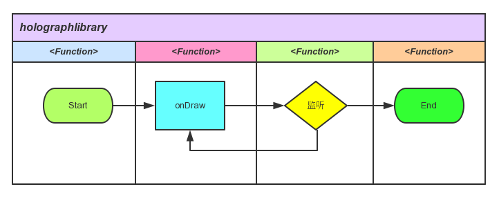
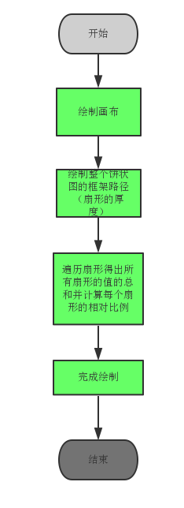
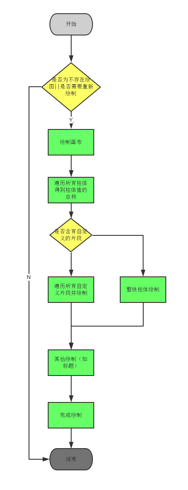
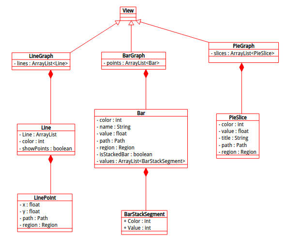

HoloGraphLibrary 实现原理解析
====================================
> 本文为 [Android 开源项目实现原理解析](https://github.com/android-cn/android-open-project-analysis) 中 HoloGraphLibrary部分  
> 项目地址：[HoloGraphLibrary](https://github.com/Androguide/HoloGraphLibrary)，分析的版本：[ccc2771](https://github.com/Androguide/HoloGraphLibrary/commit/028cd2ae6916308bbb96472aafa9ecd8b1343d5c"Commit id is 28cd2ae6916308bbb96472aafa9ecd8b1343d5c")，Demo 地址：[HoloGraphLibrary Demo](https://github.com/android-cn/android-open-project-demo/tree/master/holo-graph-library-demo)    
> 分析者：[AaronPlay](https://github.com/AaronPlay)，校对者：[${校对者}](${校对者 Github 地址})，校对状态：未完成   

###1. 功能介绍  
 
HoloGraphLibrary是一个专注于常用制图控件的开源项目，扩展了一些常用的基本绘图类型，包括折线图，饼状图以及柱状图。

优点：图形设计友好，使用方便。

###2. 总体设计
本项目较为简单，总体设计请参考4.2类关系图。 

###3. 流程图
本项目的每个控件的流程较为类似，所以抽象成一个流程图。

###4. 详细设计
###4.1 核心类功能介绍
 
####4.1.1折线图：
LinePoint.java：折线的最基本元素，两点构成一条直线，属性包括二维坐标，路径以及区域等属性。

Line.java : 由点构成线，里面封装了一个包含LinePoint的数组。

LineGraph.java: 继承View类，负责折线图的绘制。

- onDraw的流程图：

####4.1.2饼状图
PieSlice.java: 扇形，构成饼状图的基本元素。封装了颜色，值，标题，路径以及区域等属性。

PieGraph.java:继承View类, 负责绘制饼状图。

- onDraw的流程图：

####4.1.3柱状图：
Bar.java:用于表现一个柱体，构成柱状图的基本元素。封装了颜色，名字，BarStackSegment（下文将会涉及）数组等属性。若需要对Bar的每一个片段进行控制，通过改变BarStackSegment的数组即可。

BarStackSegment.java:  一般来说，一个柱体用于展示一个类型的数据，而BarStackSegment是作为柱体的扩展部分，用在同一个柱体上有展现多个不同区间的数据。

BarGraph.java:继承View类，负责柱状图的绘制。

- onDraw的流程图：

###4.2 类关系图
 

  
###5. 杂谈
对于控件类的开源库，可以把重点放在与用户交互关联的互触发器上。而这个开源库，也有开发者fork之后扩展得更加有趣。[->链接](https://bitbucket.org/danielnadeau/holographlibrary)

###6. 修改完善  
在完成了上面 5 个部分后，移动模块顺序，将  
`2. 详细设计` -> `2.1 核心类功能介绍` -> `2.2 类关系图` -> `3. 流程图` -> `4. 总体设计`  
顺序变为  
`2. 总体设计` -> `3. 流程图` -> `4. 详细设计` -> `4.1 类关系图` -> `4.2 核心类功能介绍`  
并自行校验优化一遍，确认无误后，让`校对 Buddy`进行校对，`校对 Buddy`校队完成后将  
`校对状态：未完成`  
变为：  
`校对状态：已完成`  

**完成时间**  
- `两天内`完成  

**到此便大功告成，恭喜大家^_^**  
