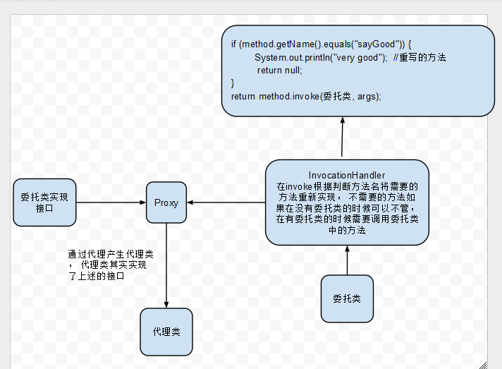

动态代理
-----------------------
>[分析者](https://github.com/Caij)

#####一、什么是动态代理？
- 1. 首先理解几个概念: 委托类和代理类 （委托类指的是被代理类）  
- 2. 动态代理指的是通过代理类代理委托类的一些方法， 代理对象是jdk动态产生。
- 3. 动态代理可以提供对另一个对象的访问，同时隐藏实际对象的具体事实； 另一点就是委托类中的某些方法不是我们需要的， 可以通过代理来实现自己想要的效果。

#####二、动态代理的实现？
  

```java
	import java.lang.reflect.InvocationHandler;
	import java.lang.reflect.Method;
	import java.lang.reflect.Proxy;

	/**
	 * @author Caij
	 */
	public class ProxyDemo {
		
		
		public static void main(String[] args) {
			/**
			 * 代理只能代理被代理类实现接口的方法， 所以被代理必须实现接口
			 * */
			final CurrentClass currentClass = new CurrentClass();
			//被代理类实现的接口
			Class<?>[] interfaces = new Class[]{ProxyInterface.class};
			//如果有实际的委托类可以这样写
			interfaces = currentClass.getClass().getInterfaces();
			ProxyInterface proxy = (ProxyInterface) Proxy.newProxyInstance(currentClass.getClass().getClassLoader(), 
						interfaces , new Handler(currentClass));
			proxy.sayGood();
		}
	}

	class Handler implements InvocationHandler {
		
		private Object object;
		
		public Handler(Object ob) {
			this.object = ob;
		}
		
		public Handler() {
		}

		/* (non-Javadoc)
		 * @see java.lang.reflect.InvocationHandler#invoke(java.lang.Object, java.lang.reflect.Method, java.lang.Object[])
		 * 这个方法中调用接口中的方法
		 */
		@Override
		public Object invoke(Object proxy, Method method, Object[] args)
				throws Throwable {
			if (method.getName().equals("sayGood")) {
				System.out.println("very good"); //需要代理的方法修改
				return null; //  返回值为空 直接返回null
			}
			return object == null ? null : method.invoke(object, args); //不需要修改的方法调用CurrentClass的方法 
		}
		
	}

	interface ProxyInterface {
		public void sayHello();
		public void sayGood();
	}

	class CurrentClass implements ProxyInterface {

		@Override
		public void sayHello() {
			System.out.println("hello");
		}

		@Override
		public void sayGood() {
			System.out.println("good");
		}
	}
```
#####三、动态代理的实现原理？
- 1. 提供委托类实现的接口
- 2. 通过实现的接口动态生成代理类， 然后在构造方法中传入InvocationHandler ，在每个实现方法中调用InvocationHandler的invoke()。
- 3. 然后重写invoke() 方法， 把自己需要的逻辑加入。  
注意1、拦截器中invoke方法体的内容就是代理对象方法体的内容
    2、当客户端执行代理对象方法时，进入到了拦截器的invoke方法体
    3、拦截器中invoke方法的method参数是在调用的时候赋值的

```java
    /** 
     * loader:类加载器 
     * interfaces:目标对象实现的接口 
     * h:InvocationHandler的实现类 
     */  
    public static Object newProxyInstance(ClassLoader loader,  
                          Class<?>[] interfaces,  
                          InvocationHandler h)  
        throws IllegalArgumentException  
        {  
        if (h == null) {  
            throw new NullPointerException();  
        }  
      
        /* 
         * Look up or generate the designated proxy class. 
         */  
        Class cl = getProxyClass(loader, interfaces);  
      
        /* 
         * Invoke its constructor with the designated invocation handler. 
         */  
        try {  
                // 调用代理对象的构造方法（也就是$Proxy0(InvocationHandler h)）  
            Constructor cons = cl.getConstructor(constructorParams);  
                // 生成代理类的实例并把InvocationHandler的实例传给它的构造方法  
            return (Object) cons.newInstance(new Object[] { h });  
        } catch (NoSuchMethodException e) {  
            throw new InternalError(e.toString());  
        } catch (IllegalAccessException e) {  
            throw new InternalError(e.toString());  
        } catch (InstantiationException e) {  
            throw new InternalError(e.toString());  
        } catch (InvocationTargetException e) {  
            throw new InternalError(e.toString());  
        }  
        }  
		
		/** 
		* 这个方法其实就是通过提供的接口产生一个实现类的字节码
		*/ 
		public static Class<?> getProxyClass(ClassLoader loader,   
                                             Class<?>... interfaces)  
        throws IllegalArgumentException  
        {  
        // 如果目标类实现的接口数大于65535个则抛出异常（我XX，谁会写这么NB的代码啊？）  
        if (interfaces.length > 65535) {  
            throw new IllegalArgumentException("interface limit exceeded");  
        }  
      
        // 声明代理对象所代表的Class对象（有点拗口）  
        Class proxyClass = null;  
      
        String[] interfaceNames = new String[interfaces.length];  
      
        Set interfaceSet = new HashSet();   // for detecting duplicates  
      
        // 遍历目标类所实现的接口  
        for (int i = 0; i < interfaces.length; i++) {  
              
            // 拿到目标类实现的接口的名称  
            String interfaceName = interfaces[i].getName();  
            Class interfaceClass = null;  
            try {  
            // 加载目标类实现的接口到内存中  
            interfaceClass = Class.forName(interfaceName, false, loader);  
            } catch (ClassNotFoundException e) {  
            }  
            if (interfaceClass != interfaces[i]) {  
            throw new IllegalArgumentException(  
                interfaces[i] + " is not visible from class loader");  
            }  
      
            // 中间省略了一些无关紧要的代码 .......  
              
            // 把目标类实现的接口代表的Class对象放到Set中  
            interfaceSet.add(interfaceClass);  
      
            interfaceNames[i] = interfaceName;  
        }  
      
        // 把目标类实现的接口名称作为缓存（Map）中的key  
        Object key = Arrays.asList(interfaceNames);  
      
        Map cache;  
          
        synchronized (loaderToCache) {  
            // 从缓存中获取cache  
            cache = (Map) loaderToCache.get(loader);  
            if (cache == null) {  
            // 如果获取不到，则新建地个HashMap实例  
            cache = new HashMap();  
            // 把HashMap实例和当前加载器放到缓存中  
            loaderToCache.put(loader, cache);  
            }  
      
        }  
      
        synchronized (cache) {  
      
            do {  
            // 根据接口的名称从缓存中获取对象  
            Object value = cache.get(key);  
            if (value instanceof Reference) {  
                proxyClass = (Class) ((Reference) value).get();  
            }  
            if (proxyClass != null) {  
                // 如果代理对象的Class实例已经存在，则直接返回  
                return proxyClass;  
            } else if (value == pendingGenerationMarker) {  
                try {  
                cache.wait();  
                } catch (InterruptedException e) {  
                }  
                continue;  
            } else {  
                cache.put(key, pendingGenerationMarker);  
                break;  
            }  
            } while (true);  
        }  
      
        try {  
            // 中间省略了一些代码 .......  
              
            // 这里就是动态生成代理对象的最关键的地方 ， 产生代理对象的字节码， 底层是通过jni实现的。 
            byte[] proxyClassFile = ProxyGenerator.generateProxyClass(  
                proxyName, interfaces);  
            try {  
                // 根据代理类的字节码生成代理类的实例  
                proxyClass = defineClass0(loader, proxyName,  
                proxyClassFile, 0, proxyClassFile.length);  
            } catch (ClassFormatError e) {  
                throw new IllegalArgumentException(e.toString());  
            }  
            }  
            // add to set of all generated proxy classes, for isProxyClass  
            proxyClasses.put(proxyClass, null);  
      
        }   
        // 中间省略了一些代码 .......  
          
        return proxyClass;  
        }  
```

**这里的代理对象可以理解为这样**
```java
/**
 * @author Caij
 * 理解方式：这样写便于理解， 底层的实现是有java虚拟机实现的
 * 代理类实现了参数中所有的接口
 * 然后在每个方法中调用InvocationHandler invoke方法， 然后将参数传入
 */
public class 代理类 implements MyInterface{
	
	private InvocationHandler handler;
	
	public MyInterfaceAdapter(InvocationHandler handler) {
		this.handler = handler;
	}

	@Override
	public void sayHello() {
		try {
			handler.invoke(this, this.getClass().getMethod("sayHello"), null);
		} catch (Throwable e) {
			e.printStackTrace();
		}
	}

	@Override
	public void sayGood() {
		try {
			handler.invoke(this, this.getClass().getMethod("sayGood"), null);
		} catch (NoSuchMethodException e) {
			e.printStackTrace();
		} catch (SecurityException e) {
			e.printStackTrace();
		} catch (Throwable e) {
			e.printStackTrace();
		}
	}
}
```

#####四、动态代理和装饰， 继承（静态代理）的比较。
代码： 这里的CurrentClass 和 ProxyInterface 是一中代理实现中的对象。
```java
	/**
	 * 继承修改方法
	 * @author Caij
	 */
	class ExtendsClass extends CurrentClass {

		/* (non-Javadoc)
		 * @see com.caij.proxy.CurrentClass#sayHello()
		 * 因为这个方法你不满意， 重写
		 */
		@Override
		public void sayHello() {
			System.out.println("very good");
		}
	}

	/**
	 * @author Caij
	 * 装饰  修改方法
	 */
	class DecorateClass implements ProxyInterface {
		
		private CurrentClass clazz;
		
		public DecorateClass(CurrentClass currentClass) {
			this.clazz = currentClass;
		}

		/* (non-Javadoc)
		 * @see com.caij.proxy.ProxyInterface#sayHello()
		 * 在不需要改变的方法直接调用被装饰类的方法
		 */
		@Override
		public void sayHello() {
			clazz.sayGood();
		}

		/* (non-Javadoc)
		 * @see com.caij.proxy.ProxyInterface#sayGood()
		 * 在需要改变的方法中写自己想要的逻辑
		 */
		@Override
		public void sayGood() {
			System.out.println("very good");
		}
	}
```

- 1.相同点：  
	* 都可以改变对象中的方法。
- 2.不同点
	* 使用场景不同， 在没有具体的类的时候装饰是实现不了的。 继承会造成大量的代码冗余， 比如需要实现的是一个接口， 那个接口有20个方法， 就必须重写20个方法。在这种环境就使用动态代理， 只关注自己代理的方法。
	* 静态代理通常只代理一个类，动态代理是代理一个接口下的多个实现类。静态代理事先知道要代理的是什么，而动态代理不知道要代理什么东西，只有在运行时才知道。
	
#####五、使用场景
- 1. android中监听事件的代理。  
	* 理由： 监听接口是没有实例的， 使用继承或者装饰的话需要实现接口， 而在事件代理的时候都是通过反射技术， 使用代理非常方便，如果要创建实现监听接口的对象造成代码冗余， 扩展性差。
```java
	public class MainActivity extends Activity {

		@Override
		protected void onCreate(Bundle savedInstanceState) {
			super.onCreate(savedInstanceState);
			setContentView(R.layout.activity_main);
			Button btn = (Button) findViewById(R.id.btn);
	//		btn.setOnClickListener(new Listener());
			
			Class<?>[] interfaces = new Class[] {OnClickListener.class};
			//代理类其实实现interfaces中所以接口
			OnClickListener proxy = (OnClickListener) Proxy.newProxyInstance(OnClickListener.class.getClass().getClassLoader(), 
				interfaces , new InvocationHandler() {
				
				@Override
				public Object invoke(Object proxy, Method method, Object[] args)
						throws Throwable {
					if (method.getName().equals("onClick")) {
						onClick(); //需要代理的方法修改
						return null; //  返回值为空 直接返回null
					}
					return null; 
				}
			});
			btn.setOnClickListener(proxy);
		}
		
		
		public void onClick() {
			Toast.makeText(MainActivity.this, "我被点击了", Toast.LENGTH_LONG).show(); 
		}
		
		private class Listener implements OnClickListener {

			@Override
			public void onClick(View v) {
				onClick();
			}
		}

	}
```	

- 2. web开发中spring aop编程
	* 理由：目标方法之间完全是松耦合。  比如在Dao中， 每次数据库操作都需要开启事务， 而且在操作的时候需要关注权限。  如果这些逻辑都放在dao中就会造成代码冗余， 耦合度高。
```java
	//伪代码
	Dao {
		save() {
			判断是否有保存的权限；
			开启事务；
			保存；
			提交事务；
		}
		
		delete() {
			判断是否有删除的权限；
			开启事务；
			删除；
			提交事务；
		}
	}
	
	// 使用动态代理, 组合每个切面的方法， 而每个切面只需要关注自己的逻辑就行， 就达到减少代码， 松耦合的效果
	invoke(Object proxy, Method method, Object[] args)
						throws Throwable {
					判断是否有权限；
					开启事务；
					Object ob = method.invoke(dao, args)；
					提交事务；
					return ob; 
				}
				
				
```	
	
