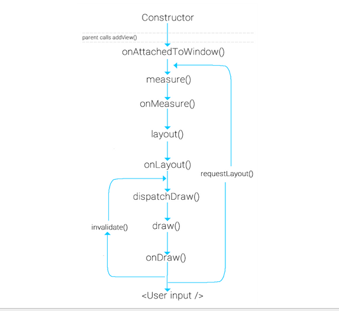
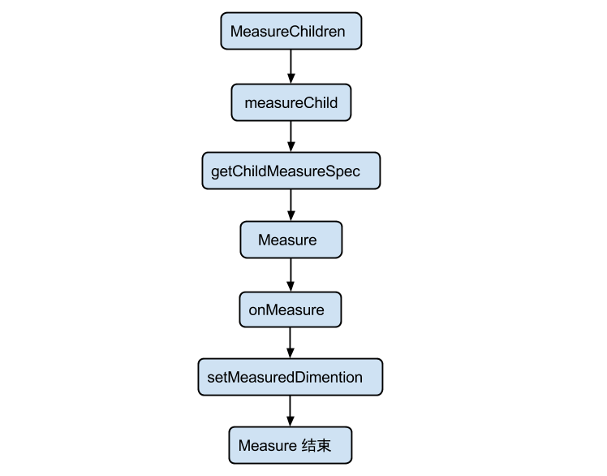
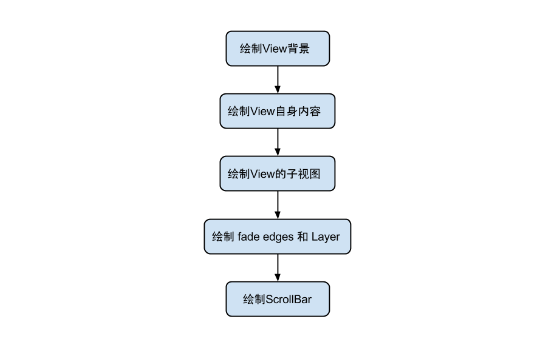

View 绘制流程
----------------
> 本文为 [Android 开源项目源码解析](https://github.com/android-cn/android-open-project-analysis) 公共技术点中的 View 绘制流程 部分  
 分析者：[lightSky](https://github.com/lightSky)  

#### View 绘制机制  
#####1. View 树的绘图流程
整个 View 树的绘图流程是在`ViewRoot.java`类的`performTraversals()`函数展开的，该函数做的执行过程可简单概况为根据之前设置的状态，判断是否需要重新计算视图大小(measure)、是否重新需要安置视图的位置(layout)、以及是否需要重绘(draw)，这里就不做延展了，我们只介绍在自定义 View 中直接涉及到的一些部分，整个流程如下  
  

** View 绘制流程函数调用链**  
  
图片来自 https://plus.google.com/+ArpitMathur/posts/cT1EuBbxEgN  

#####2. 概念 
参考文献：http://developer.android.com/guide/topics/ui/how-android-draws.html  

当 Activity 接收到焦点的时候，它会被请求绘制布局。Android framework 将会处理绘制的流程，但 Activity 必须提供 View 层级的根节点。绘制是从根节点开始的，需要 measure 和 draw 布局树。绘制会遍历和渲染每一个与无效区域相交的 View 。相反，每一个 ViewGroup 负责绘制它所有的子视图，而最底层的 View 会负责绘制自身。树的遍历是有序的，父视图会先于子视图被绘制，

**measure 和 layout**  

从整体上来看 Measure 和 Layout 两个步骤的执行：
  

**具体分析**  
measure 过程的发起是在`measure(int, int)`方法中，而且是从上到下有序的绘制 View 。在递归的过程中，每一个父视图将尺寸规格向下传递给子视图，在 measure 过程的最后，每个视图存储了自己的尺寸。
layout 过程从`layout(int, int, int, int)`方法开始，也是自上而下进行遍历。在这个过程中，每个父视图会根据 measure 过程得到的尺寸确定所有的子视图的具体位置。  

注意：Android 框架不会绘制无效区域之外的部分，但会考虑绘制视图的背景。你可以使用`invalidate()`去强制对一个 View 进行重绘。  

当一个 View 的 measure 过程进行完的时候，它自己及其所有子节点的`getMeasuredWidth()`和`getMeasuredHeight()`方法的值就必须被设置了。一个视图的测量宽度和测量高度值必须在父视图约束范围之内，这可以保证在 measure 的最后，所有的父母都接收所有孩子的测量。
一个父视图，可以在其子视图上多次的调用`measure()`方法。比如，父视图可以先根据未给定的 dimension 调用 measure 方法去测量每一个
子视图的尺寸，如果所有子视图的未约束尺寸太大或者太小的时候，则会使用一个确切的大小，然后在每一个子视图上再次调用 measure 方法去测量每一个 View 的大小。（也就是说，如果子视图对于 Measure 得到的大小不满意的时候，父视图会介入并设置测量规则进行第二次 measure）

**measure 过程传递尺寸的两个类**  
- ViewGroup.LayoutParams 类（View 自身的布局参数）  
- MeasureSpecs 类（父视图对子视图的测量要求）

ViewGroup.LayoutParams  
用于子视图告诉其父视图它们应该怎样被测量和放置（就是子视图自身的布局参数）。一个基本的 LayoutParams 只用来描述视图的高度和宽度。对于每一方面的尺寸（height 和 width），你可以指定下列方式之一：  
- 具体数值   
- MATCH_PARENT 表示子视图希望和父视图一样大(不含padding)   
- WRAP_CONTENT 表示视图为正好能包裹其内容大小(包含padding)    

ViewGroup 的子类，也有相应的 ViewGroup.LayoutParams 的子类，例如 RelativeLayout 有相应的 ViewGroup.LayoutParams 的子类，拥有设置子视图水平和垂直的能力。其实子 view.getLayoutParams()获取到的 LayoutParams 类型就是其所在父控件类型相应的 Params，比如 View 的父控件为 RelativeLayout，那么得到的 LayoutParams 类型就为 RelativeLayoutParams。在强转的时候注意别出错。  

MeasureSpecs  
其包含的信息有测量要求和尺寸，有三种模式:    

- UNSPECIFIED  
父视图不对子视图有任何约束，它可以达到所期望的任意尺寸。一般用不到，ListView、ScrollView

- EXACTLY  
父视图为子视图指定一个确切的尺寸，而且无论子视图期望多大，它都必须在该指定大小的边界内，对应的属性为 match_parent 或具体指，比如 100dp，父控件可以直接得到子控件的尺寸，该尺寸就是`MeasureSpec.getSize(measureSpec)`得到的值。

- AT_MOST  
父视图为子视图指定一个最大尺寸。子视图必须确保它自己的所有子视图可以适应在该尺寸范围内，对应的属性为 wrap_content，父控件无法确定子 View 的尺寸，只能由子控件自己根据需求去计算自己的尺寸，对于自定义的空间来说，就需要你自己去实现该测量逻辑。
 
#####3. measure 核心方法  
- measure(int widthMeasureSpec, int heightMeasureSpec)  
该方法定义在`View.java`类中，final 修饰符修饰，因此不能被重载，但 measure 调用链会回调 View/ViewGroup 对象的 onMeasure()方法，因此我们只需要复写 onMeasure() 方法去根据需求计算自己的控件尺寸即可。

- onMeasure(int widthMeasureSpec, int heightMeasureSpec)  
该方法的两个参数是父视图提供的测量要求。当父视图调用子视图的 measure 函数对子视图进行测量时，会传入这两个参数。通过这两个参数以及子视图本身的 LayoutParams 来共同决定子视图的测量要求 MeasureSpec。其实整个 measure 过程就是从上到下遍历，不断的根据父视图的宽高要求 MeasureSpec 和子视图自身的 LayotuParams 获取子视图自己的宽高测量要求 MeasureSpec，最终调用子视图的 measure(int widthMeasureSpec, int heightMeasureSpec) 方法（内部调用setMeasuredDimension）确定自己的 mMeasuredWidth 和 mMeasuredHeight。ViewGroup 的 measureChildren 和 measureChildWithMargins 方法体现了该过程，下面对该过程做了分析。  

- setMeasuredDimension()  
 View 在测量阶段的最终尺寸是由`setMeasuredDimension()`方法决定的，该方法最终会对每个 View 的 mMeasuredWidth 和 mMeasuredHeight 进行赋值，一旦这两个变量被赋值，就意味着该 View 的整个测量过程结束了，setMeasuredDimension()也是必须要调用的方法，否则会报异常。通常我们在自定义的时候，是不需要管上述的 Measure 过程的，只需要在`setMeasuredDimension()`方法内部，根据需求，去计算自己 View 的尺寸即可，你可以在 [ViewPagerIndicator](https://github.com/android-cn/android-open-project-analysis/tree/master/view-pager-indicator) 的自定义 View 的尺寸计算看到。  

下面三个和 MeasureSpec 相关方法的返回的值都是在`getChildMeasureSpec()`中确定的，后面的源码有详细分析

- makeMeasureSpec(int size, int mode)
```java
        /**
         * 根据提供的 size 和 mode 创建一个 measure specification，包含了 View 的尺寸和测量要求
         * 返回的 mode 必须为以下枚举值之一：
         * 
         *  View.MeasureSpec#UNSPECIFIED}
         *  View.MeasureSpec#EXACTLY}
         *  View.MeasureSpec#AT_MOST}
         * 
         * 在 API17 以及之前，makeMeasureSpec 的实现是：参数的顺序是不重要的，而且任何值的
         * 溢出都可能会影响到 MeasureSpec 的结果，RelativeLayout 就受此 bug 影响。在 API 17 之后，
         * 修复了此 bug，使行为更加严谨。
         *
         * @param size the size of the measure specification
         * @param mode the mode of the measure specification
         * @return the measure specification based on size and mode
         */
        public static int makeMeasureSpec(int size, int mode) {
            if (sUseBrokenMakeMeasureSpec) {
                return size + mode;
            } else {
                return (size & ~MODE_MASK) | (mode & MODE_MASK);
            }
        }
```        
- getMode(int measureSpec)
```java 
        /**
         * 从提供的 measure specification 中抽取 Mode，在确定 View 的尺寸时，需要根据该 Mode 来决定如何确定最终值
         */
        public static int getMode(int measureSpec) {
            return (measureSpec & MODE_MASK);
        }
```
- getSize(int measureSpec)
```java
        /**
         * 从提供的 measure specification 中抽取尺寸，在确定自定义 View 的尺寸时，使用该方法获取到系统 Measure 的值，
         * 然后根据 getMode 方法得到的测绘要求，在 Measure 值和自己计算的值中确定最终值。
         *
         * @return 根据给定的 measure specification 得到的以 pixels 为单位的尺寸
         */
        public static int getSize(int measureSpec) {
            return (measureSpec & ~MODE_MASK);
        }
```

下面我们取 ViewGroup 的 measureChildren（int widthMeasureSpec, int heightMeasureSpec) 方法对整个 Measure 流程做一个分析：
MeasureChild 的方法调用流程图：  
    

**源码分析**
```java
    /**
     * 请求所有子 View 去 measure 自己，要考虑的部分有对子 View 的测绘要求 MeasureSpec 以及其自身的 padding
     * 这里跳过所有为 GONE 状态的子 View ，最繁重的工作是在 getChildMeasureSpec 方法中处理的
     *
     * @param widthMeasureSpec  对该 View 的 width 测绘要求
     * @param heightMeasureSpec 对该 View 的 height 测绘要求
     */
    protected void measureChildren(int widthMeasureSpec, int heightMeasureSpec) {
        final int size = mChildrenCount;
        final View[] children = mChildren;
        for (int i = 0; i < size; ++i) {
            final View child = children[i];
            if ((child.mViewFlags & VISIBILITY_MASK) != GONE) {
                measureChild(child, widthMeasureSpec, heightMeasureSpec);
            }
        }
    }
    
    protected void measureChild(View child, int parentWidthMeasureSpec,
            int parentHeightMeasureSpec) {
        final LayoutParams lp = child.getLayoutParams();

        final int childWidthMeasureSpec = getChildMeasureSpec(parentWidthMeasureSpec,// 获取 ChildView的widthMeasureSpec
                mPaddingLeft + mPaddingRight, lp.width);
        final int childHeightMeasureSpec = getChildMeasureSpec(parentHeightMeasureSpec,// 获取 ChildView的heightMeasureSpec
                mPaddingTop + mPaddingBottom, lp.height);

        child.measure(childWidthMeasureSpec, childHeightMeasureSpec);
    }
    
   /**
    *	getChildMeasureSpec() 的分析有点多，只为了分析系统如何确定子视图的 MeasureSpec 和 size 的
    */
  
   /** 
     * 该方法是 measureChildren 中最繁重的部分，为每一个 ChildView 计算出自己的 MeasureSpec。
     * 目标是将 ChildView 的 MeasureSpec 和 LayoutParams 结合起来去得到一个最合适的结果。
     * 比如，如果该 View 知道自己的尺寸（假设它的MeasureSpec Mode 为 EXACTLY），并且该 Child 已经在它的
     * LayoutParams 中表明了想获得一个和父视图相同的大小（MatchParent），那么 parent 应该请求该 Child
     * 以一个给定的尺寸放置
     *
     * @param spec 对该 View 的测绘要求
     * @param padding 当前 View 在当前唯独上的 paddingand，也有可能含有 margins
     *
     * @param childDimension 在当前维度上（height或width）的具体指
     * @return a MeasureSpec integer for the child
     */
    public static int getChildMeasureSpec(int spec, int padding, int childDimension) {
    
	    int specMode = MeasureSpec.getMode(spec);  // 获得父视图的测量要求  
	    int specSize = MeasureSpec.getSize(spec);  // 获得父视图的实际值  
	  
	    int size = Math.max(0, specSize - padding); // 父视图的大小减去边距值
	  
	    int resultSize = 0;    // 子视图的实际值
	    int resultMode = 0;    // 子视图的测量要求 
	  
	    switch (specMode) {  
	    // Parent has imposed an exact size on us  
	    // 父视图的测量要求为 EXACTLY：为子视图指定了一个明确值
	    case MeasureSpec.EXACTLY:   
	        // 子视图的 width 或 height 是个精确值，则直接使用该精确值
	        if (childDimension >= 0) {            
	            resultSize = childDimension;         
	            resultMode = MeasureSpec.EXACTLY;    // 子视图的Mode设置为 EXACTLY
	        }   
	        // 子视图的 width 或 height 的属性为 MATCH_PARENT，
	        else if (childDimension == LayoutParams.MATCH_PARENT) {  
	            // Child wants to be our size. So be it.  
	            resultSize = size;                   // 则为子View设置父视图的大小（减去 padding 后）
	            resultMode = MeasureSpec.EXACTLY;    // 子视图测量要求设置为 EXACTLY
	        }   
	        // 子视图的 width 或 height 的属性为 WRAP_CONTENT：
	        else if (childDimension == LayoutParams.WRAP_CONTENT) {  
	            // 子视图希望自己确定大小，但不能比父视图大
	            resultSize = size;                  // 为子视图指定了一个最大值
	            resultMode = MeasureSpec.AT_MOST;  // 子视图测量要求设置为 AT_MOST
	        }  
	        break;  
   
	    // 父视图的测绘要求为 AT_MOST
	    case MeasureSpec.AT_MOST:  
	        // 子视图的 width 或 height 是个精确值
	        if (childDimension >= 0) {  
	            resultSize = childDimension;        // 则直接使用该值
	            resultMode = MeasureSpec.EXACTLY;   // 子视图测量要求为 EXACTLY   
	        }  
	        // 子视图的 width 或 height 的属性为 MATCH_PARENT
	        else if (childDimension == LayoutParams.MATCH_PARENT) {  
	            // 子视图希望和父视图相同大小，但是父视图的大小没有指定，
	            // 只能约束子视图大小不能比父视图大
	            resultSize = size;                  // 子视图尺寸为父视图大小  
	            resultMode = MeasureSpec.AT_MOST;   // 子视图测量要求为 AT_MOST  
	        }  
	        // 子视图的 width 或 height 属性为 WRAP_CONTENT  
	        else if (childDimension == LayoutParams.WRAP_CONTENT) {  
	             // 子视图希望和父视图相同大小，其大小不能比父视图大
	            resultSize = size;                  // 子视图尺寸为父视图大小  
	            resultMode = MeasureSpec.AT_MOST;   // 子视图测量要求为 AT_MOST  
	        }  
	        break;  
	  
	    // 父视图的测绘要求为 UNSPECIFIED，大小没有约束
	    case MeasureSpec.UNSPECIFIED:  
	        // 子视图的 width 或 height 的属性是精确值，则直接使用该值
	        if (childDimension >= 0) {  
	            resultSize = childDimension;      
	            resultMode = MeasureSpec.EXACTLY;   // 子视图测量要求为 EXACTLY  
	        }  
	        // 子视图的 width 或 height 的属性为 MATCH_PARENT
	        else if (childDimension == LayoutParams.MATCH_PARENT) {  
	            // 子视图希望和父视图一样大，由于父视图没指定，则这里也无法确定子视图大小
	            // 设置为 0，后续处理
	            resultSize = 0;                        
	            resultMode = MeasureSpec.UNSPECIFIED;  // 子视图测量要求为 UNSPECIFIED  
	        }   
	        // 子视图的 width 或 height 的属性为 WRAP_CONTENT，子视图大小也无法确定
	        else if (childDimension == LayoutParams.WRAP_CONTENT) {  
	            resultSize = 0;                        
	            resultMode = MeasureSpec.UNSPECIFIED;  // 子视图测量要求为 UNSPECIFIED  
	        }  
	        break;  
	    }  
	    // 根据获取到的子视图的测量要求和大小创建子视图的MeasureSpec
	    return MeasureSpec.makeMeasureSpec(resultSize, resultMode);  
    }
    
   /**
     *
     * 用于获取 View 最终的大小，父视图提供了宽、高的约束信息
     * 一个 View 的真正的测量工作是在 onMeasure(int, int) 中，由该方法调用。
     * 因此，只有 onMeasure(int, int) 可以而且必须被子类复写
     *
     * @param widthMeasureSpec 在水平方向上，父视图指定的的 Measure 要求
     * @param heightMeasureSpec 在竖直方向上，控件上父视图指定的 Measure 要求
     *
     */
    public final void measure(int widthMeasureSpec, int heightMeasureSpec) {
      ...
      
      onMeasure(widthMeasureSpec, heightMeasureSpec);
      
      ...
    }
    
    protected void onMeasure(int widthMeasureSpec, int heightMeasureSpec) {
        setMeasuredDimension(getDefaultSize(getSuggestedMinimumWidth(), widthMeasureSpec),
                getDefaultSize(getSuggestedMinimumHeight(), heightMeasureSpec));
    }
    
    /**
     * 返回默认值的方法，如果 MeasureSpec 没有约束（Mode为UNSPECIFIED），则使用给定的值
     * 如果 MeasureSpec 允许，将得到一个更大的值。 
     * @param size 该 View 的默认值
     * @param measureSpec 父视图的约束
     * @return 该 View 应该的大小
     */
    public static int getDefaultSize(int size, int measureSpec) {
        int result = size;
        int specMode = MeasureSpec.getMode(measureSpec);
        int specSize = MeasureSpec.getSize(measureSpec);

        switch (specMode) {
        case MeasureSpec.UNSPECIFIED:// 父视图没有任何约束，则返回 getSuggestedMinimumWidth() 得到的最小值
            result = size;
            break;
        case MeasureSpec.AT_MOST:// 父视图有约束，则返回 MeasureSpec.getSize(measureSpec) 的值，
        case MeasureSpec.EXACTLY:// 该值则是 getChildMeasureSpec 方法内部处理确定的
            result = specSize;
            break;
        }
        return result;
    }
    
    /**
     * 返回建议的最小宽度值。会在 View 的最小值和背景图片的最小值之间获取一个较大的值
     * 当在 onMeasure(int, int) 方法中使用的时候，调用者应该始终保证返回的宽度值在其父视图
     * 要求的范围内
     * @return 当前 View 的建议最小宽度值
     */
    protected int getSuggestedMinimumWidth() {
        return (mBackground == null) ? mMinWidth : max(mMinWidth, mBackground.getMinimumWidth());
    }
```


#####4. layout 相关概念及核心方法  
子视图的具体位置都是相对于父视图而言的。  
与 Measure 过程类似，ViewGroup 在 onLayout 函数中通过调用子视图的 layout 方法来设置其在父视图中的位置，具体位置由函数 layout 的参数决定
View 的 onLayout 方法为空实现，而 ViewGroup 的 onLayout 为 abstract 的，因此，如果自定义的 View 要继承 ViewGroup 时，必须实现 onLayout 函数，而 onMeasure 并不强制实现，因为相对与 layout 来说，measure 过程并不是必须的，原因可以看下面的注释。  

**Note:**  
在遍历的过程中，子视图会调用`getMeasuredWidth()`和`getMeasuredHeight()`方法获取到 measure 过程得到的 mMeasuredWidth 和 mMeasuredHeight，作为自己的 width 和 height。然后调用每一个子视图的`layout(l, t, r, b)`函数，来确定每个子视图在父视图中的显示位置。    

measure 过程不是必须的，因为 View 的 Layout 步骤是在 Measure 之后，在 Layout 里可以拿到 Measure 过程得到的值进行 Layout，当然你也可以对 Measure 过程的值进行修改，但这样肯定是不可取的，这样违背了 Android 框架的绘制机制，要不 Measure 过程这么做的工作还有啥用。通常的做法是根据需求在 measure 过程决定尺寸，layout 步骤决定位置，除非你所定义的 View 只需要指定 View 的位置，而不考虑 View 的尺寸。  

LinearLayout 的 onLayout 源码分析：
```java
  @Override
    protected void onLayout(boolean changed, int l, int t, int r, int b) {
        if (mOrientation == VERTICAL) {
            layoutVertical(l, t, r, b);
        } else {
            layoutHorizontal(l, t, r, b);
        }
    }
    
    /**
     * 遍历所有的子 View，为其设置相对父视图的坐标
     */
    void layoutVertical(int left, int top, int right, int bottom) {
	for (int i = 0; i < count; i++) {
	            final View child = getVirtualChildAt(i);
	            if (child == null) {
	                childTop += measureNullChild(i);
	            } else if (child.getVisibility() != GONE) {
	                final int childWidth = child.getMeasuredWidth();//measure过程确定的Width
	                final int childHeight = child.getMeasuredHeight();//measure过程确定的height
	                
	                ...确定 childLeft、childTop 的值
	
	                setChildFrame(child, childLeft, childTop + getLocationOffset(child),
	                        childWidth, childHeight);
	            }
	        }
	}
	
    private void setChildFrame(View child, int left, int top, int width, int height) {        
        child.layout(left, top, left + width, top + height);
    }	
      
    View.java
    public void layout(int l, int t, int r, int b) {
    	...
    	setFrame(l, t, r, b)
    }
    
    /**
     * 为该子 View 设置相对其父视图上的坐标
     */
     protected boolean setFrame(int left, int top, int right, int bottom) {
     	...
     }
```
#####5. 绘制流程相关概念及核心方法    
draw 过程在`measure()`和`layout()`之后进行，会调用 mView 的`draw()`函数，这里的 mView 对于 Actiity 来说就是 PhoneWindow.DecorView。  

先来看下与 draw 过程相关的函数：  

- ViewRootImpl.draw()：  
仅在 ViewRootImpl.performTraversals() 的内部调用

- DecorView.draw()：  
ViewRootImpl.draw() 方法会调用该函数，DecorView.draw() 继承自 Framelayout，由于 DecorView、FrameLayout 以及 FrameLayout 的父类 ViewGroup 都未复写`draw()`，因此DecorView.draw()其实调用的就是`View.draw()`。

- View.onDraw()：  
绘制 View 本身，默认为空实现，自定义的复合 View 往往需要重载该函数来绘制 View 自身的内容。

- View.dispatchDraw()：   
发起对子视图的绘制，内部循环调用View.drawChild()对子 View 进行绘制。View 中的 dispatchDraw 是空实现，系统实现的一些复合视图实现了该方法，你不应该重载它们的`dispatchDraw()`方法，因为该函数的默认实现代表了 View 的绘制流程，你不可能也没必要把系统的绘制流程写一遍吧。

- ViewGroup.drawChild()：  
该函数只在ViewGroup中实现，因为只有 ViewGroup 才需要绘制 child，drawChild 内部还是调用`View.draw()`来完成子视图的绘制（也有可能直接调用 dispatchDraw）。

绘制流程图  
    

**- View.draw(Canvas) 源码分析**  
```java
 /**
     * Manually render this view (and all of its children) to the given Canvas.
     * The view must have already done a full layout before this function is
     * called.  When implementing a view, implement
     * {@link #onDraw(android.graphics.Canvas)} instead of overriding this method.
     * If you do need to override this method, call the superclass version.
     *
     * @param canvas The Canvas to which the View is rendered.  
     *
     * 根据给定的 Canvas 自动渲染 View（包括其所有子 View）。在调用该方法之前必须要完成 layout。当你自定义 view 的时候，
     * 应该去是实现 onDraw(Canvas) 方法，而不是 draw(canvas) 方法。如果你确实需要复写该方法，请记得先调用父类的方法。
     */
    public void draw(Canvas canvas) {
    
        / * Draw traversal performs several drawing steps which must be executed
         * in the appropriate order:
         *
         *      1. Draw the background if need
         *      2. If necessary, save the canvas' layers to prepare for fading
         *      3. Draw view's content
         *      4. Draw children (dispatchDraw)
         *      5. If necessary, draw the fading edges and restore layers
         *      6. Draw decorations (scrollbars for instance)
         */

 	// Step 1, draw the background, if needed
        if (!dirtyOpaque) {
            drawBackground(canvas);
        }
        
         // skip step 2 & 5 if possible (common case)
        final int viewFlags = mViewFlags;
        if (!verticalEdges && !horizontalEdges) {
            // Step 3, draw the content
            if (!dirtyOpaque) onDraw(canvas);

            // Step 4, draw the children
            dispatchDraw(canvas);

            // Step 6, draw decorations (scrollbars)
            onDrawScrollBars(canvas);

            if (mOverlay != null && !mOverlay.isEmpty()) {
                mOverlay.getOverlayView().dispatchDraw(canvas);
            }

            // we're done...
            return;
        }
        
        // Step 2, save the canvas' layers
        ...
        
        // Step 3, draw the content
        if (!dirtyOpaque) 
        	onDraw(canvas);

        // Step 4, draw the children
        dispatchDraw(canvas);

        // Step 5, draw the fade effect and restore layers
        
        // Step 6, draw decorations (scrollbars)
        onDrawScrollBars(canvas);
    }

```

源码中已经清楚的注释了整个绘制过程：  
View 的背景绘制---->保存 Canvas 的 layers --->View 本身内容的绘制---->子视图的绘制---->绘制渐变框---->滚动条的绘制  
当不需要绘制 Layer 的时候第二步和第五步可能跳过。**因此在绘制的时候，能省的 layer 尽可省，可以提高绘制效率**

onDraw() 和 dispatchDraw() 分别为 View 本身内容和子视图绘制的函数。  
View 和 ViewGroup的onDraw() 都是空实现，因为具体 View 如何绘制由设计者来决定的，默认不绘制任何东西。

ViewGroup 复写了`dispatchDraw()`来对其子视图进行绘制，通常你自己定义的 ViewGroup 不应该对`dispatchDraw()`进行复写，因为它的默认实现体现了 View 系统的绘制流程，该流程所做的一系列工作你不用去管，你要做的就是复写`View.onDraw(Canvas)`方法或者`ViewGroup.draw(Canvas)`方法，但在`ViewGroup.draw(Canvas)`方法调用前，记得先调用`super.draw(canvas)`方法，先去绘制基础的 View，然后你可以在`ViewGroup.draw(Canvas)`方法里做一些自己的绘制，在高级的自定义中会有这样的需求。

- dispatchDraw(Canvas)  
核心代码就是通过 for 循环调用`drawChild(canvas, child, drawingTime)`方法对 ViewGroup 的每个子视图运用动画以及绘制。

**ViewGroup.dispatchDraw() 源码分析**

```java
dispatchDraw(Canvas canvas){

...

 if ((flags & FLAG_RUN_ANIMATION) != 0 && canAnimate()) {//处理ChildView的动画
 	final boolean buildCache = !isHardwareAccelerated();
            for (int i = 0; i < childrenCount; i++) {
                final View child = children[i];
                if ((child.mViewFlags & VISIBILITY_MASK) == VISIBLE) {//** 只绘制 Visible 状态的布局，因此可以通过延时加载来提高效率**
                    final LayoutParams params = child.getLayoutParams();
                    attachLayoutAnimationParameters(child, params, i, childrenCount);// 添加布局变化的动画
                    bindLayoutAnimation(child);//为Child绑定动画
                    if (cache) {
                        child.setDrawingCacheEnabled(true);
                        if (buildCache) {
                            child.buildDrawingCache(true);
                        }
                    }
                }
            }
            
 	final LayoutAnimationController controller = mLayoutAnimationController;
            if (controller.willOverlap()) {
                mGroupFlags |= FLAG_OPTIMIZE_INVALIDATE;
            }

	controller.start();// 启动 View 的动画
}

 // 绘制 ChildView
 for (int i = 0; i < childrenCount; i++) {
            int childIndex = customOrder ? getChildDrawingOrder(childrenCount, i) : i;
            final View child = (preorderedList == null)
                    ? children[childIndex] : preorderedList.get(childIndex);
            if ((child.mViewFlags & VISIBILITY_MASK) == VISIBLE || child.getAnimation() != null) {
                more |= drawChild(canvas, child, drawingTime);
            }
        }

...

}

protected boolean drawChild(Canvas canvas, View child, long drawingTime) {
        return child.draw(canvas, this, drawingTime);
}

/**
     * This method is called by ViewGroup.drawChild() to have each child view draw itself.
     * This draw() method is an implementation detail and is not intended to be overridden or
     * to be called from anywhere else other than ViewGroup.drawChild().
     */
    boolean draw(Canvas canvas, ViewGroup parent, long drawingTime) {
        ...
    }

```
- drawChild(canvas, this, drawingTime)  
直接调用了 View 的`child.draw(canvas, this,drawingTime)`方法，文档中也说明了，除了被`ViewGroup.drawChild()`方法外，你不应该在其它任何地方去复写或调用该方法，它属于 ViewGroup。而`View.draw(Canvas) `方法是我们自定义控件中可以复写的方法，具体可以参考上述对`view.draw(Canvas)`的说明。child.draw(canvas, this, drawingTime) 肯定是处理了和父视图相关的逻辑，但对于 View 的绘制，最终调用的还是 View.draw(Canvas) 方法。

- invalidate()  
请求重绘 View 树，即 draw 过程，假如视图发生大小没有变化就不会调用`layout()`过程，并且只绘制那些调用了`invalidate()`方法的 View。

- requestLayout()  
当布局变化的时候，比如方向变化，尺寸的变化。你可以手动调用该方法，会触发`measure()`和`layout()`过程（不会进行 draw）。  

参考资料  
[how-android-draws](http://developer.android.com/guide/topics/ui/how-android-draws.html)  
http://blog.csdn.net/wangjinyu501/article/details/9008271  
http://blog.csdn.net/qinjuning/article/details/7110211  
http://blog.csdn.net/qinjuning/article/details/8074262
