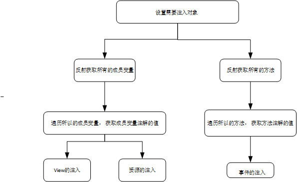
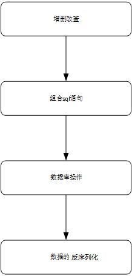
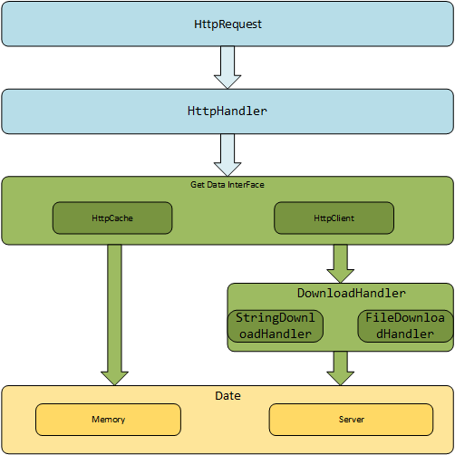
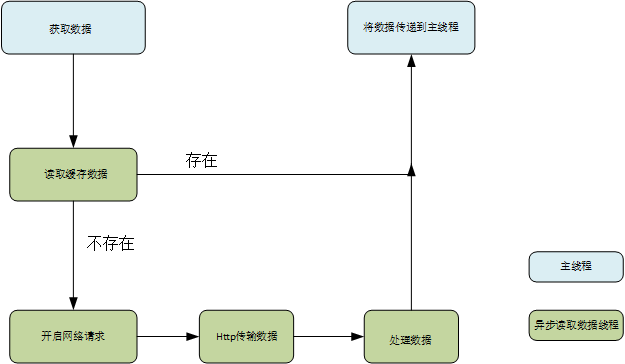
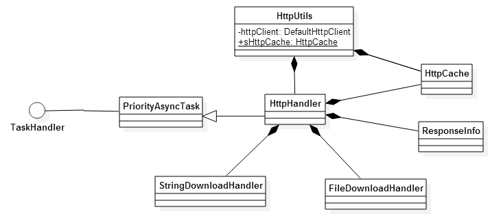
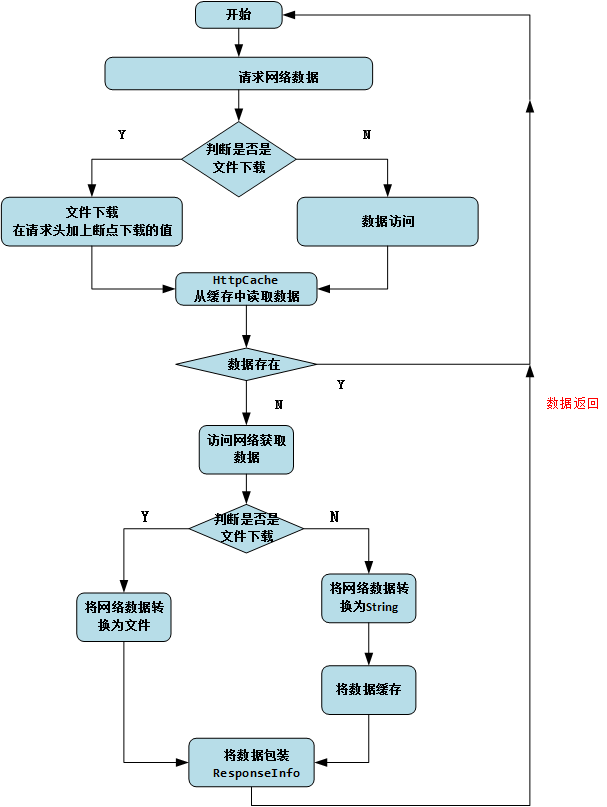
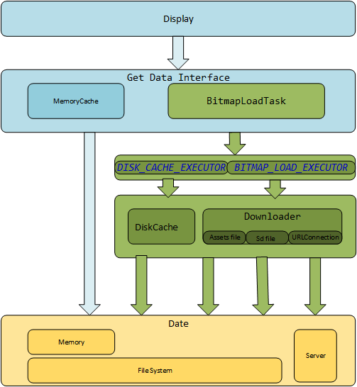
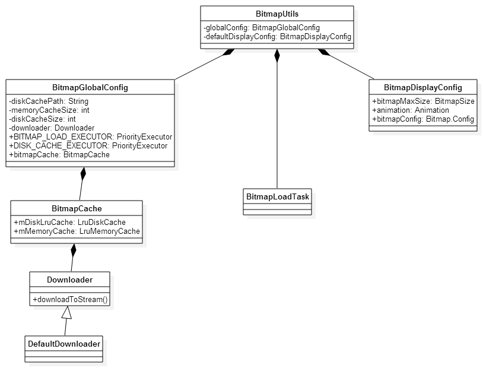
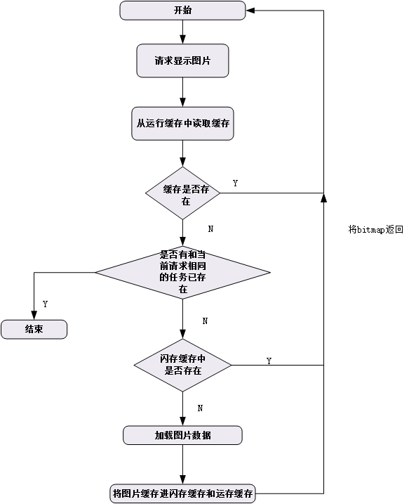
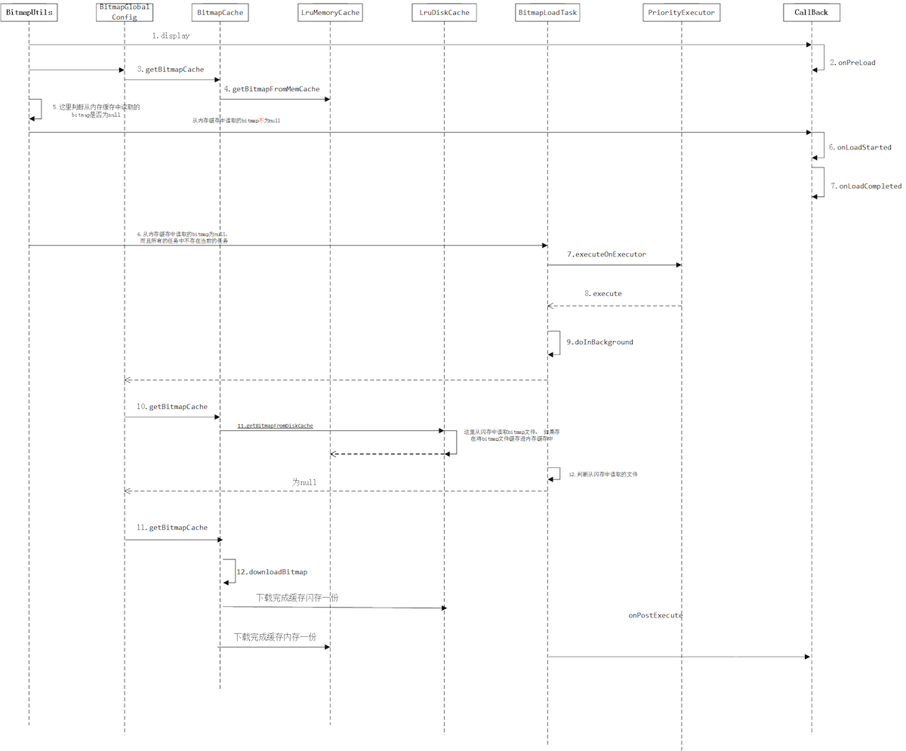

xUtils 实现原理解析
====================================
> 本文为 [Android 开源项目实现原理解析](https://github.com/android-cn/android-open-project-analysis) 中 xUtils 部分。  
> 项目地址：[xUtils](https://github.com/wyouflf/xUtils)，分析的版本：[192c2a886c](https://github.com/wyouflf/xUtils/commit/192c2a886c2d467e50718c6e469de63696f5cded)，Demo 地址：[xUtils Demo](https://github.com/android-cn/android-open-project-demo/tree/master/xutils-demo)  
> 分析者：[Caij](https://github.com/Caij)，校对者：[maogy](https://github.com/maogy)，校对状态：未完成   

  
###1. 功能介绍  
xUtils一个Android公共库框架，主要包括四个部分：View，Db, Http, Bitmap 四个模块。
- View模块主要的功能是通过注解绑定UI，资源，事件。
- Db模块是一个数据库orm框架， 简单的语句就能进行数据的操作。
- Http模块主要访问网络，支持同步，异步方式的请求，支持文件的下载。
- Bitmap模块是加载图片以及图片的处理， 支持加载本地，网络图片。而且支持图片的内存和本地缓存。  


###2. 详细设计  
  
  
####2.1 View模块
#####2.1.1 总体设计
流程和关系较少， 请看下面的详细分析
#####2.1.2 流程图

#####2.1.3 核心类功能介绍
######请先了解[注解](https://github.com/android-cn/android-open-project-analysis/blob/master/tech/annotation.md) ，[动态代理](https://github.com/android-cn/android-open-project-analysis/blob/master/tech/proxy.md)  可以帮助到您， 如果已经了解请忽略。
注解和反射知识是这个模块的主要内容
#####1.ViewUtils.java  
View和各种事件的注入以及资源的注入。
######(1)主要函数
```java
	private static void injectObject(Object handler, ViewFinder finder)	 
``` 
第一个参数Object handler代表的是需要注入的对象， 第二个参数是需要注入View（这个View就是handler的成员变量）所在的View或者Activity的包装对象。
该方法完成了View和各种事件的注入以及资源的注入。主要的原理就是通过反射和注解。  
- 完成Activity的setContentView。  
- 完成View的注入。  
- 完成资源的注入。  
- 完成各种事件的注入。  
  
#####2.ViewFinder.java    
######(1)主要函数
```java  
	public View findViewById(int id, int pid)
	public View findViewById(int id)
```
如果存在父View， 优先从父View寻找，否则从当前的View或者Activity中寻找。

#####3.ResLoader.java 
```java  
	public static Object loadRes(ResType type, Context context, int id)
```
获取资源文件值。支持多种资源的获取。

#####4.EventListenerManager.java 
事件的注入， 其中的设计是通过动态代理。
```java  
private final static DoubleKeyValueMap<ViewInjectInfo, Class<?>, Object> listenerCache =
            new DoubleKeyValueMap<ViewInjectInfo, Class<?>, Object>(); 
```
存放监听事件接口map。 因为有些接口有多个函数， 代理会判断事件接口是否存在， 如果存在只增加代理方法就够了， 避免重新设置监听事件接口。
```java 
public static void addEventMethod(
            ViewFinder finder,
            ViewInjectInfo info,
            Annotation eventAnnotation,
            Object handler,
            Method method) 
```
代理监听事件

#####5.注解类

  
    
####2.2 Db模块
#####2.2.1 总体设计
流程和关系较少， 请看下面的详细分析
#####2.2.2 流程图

#####2.2.3 核心类功能介绍
注解、反射和数据库操作知识这个模块的主要内容
#####1.DbUtils.java  
主要功能数据库的创建，数据库的增删改查。
```java 
	private static HashMap<String, DbUtils> daoMap = new HashMap<String, DbUtils>();
```  
存放DbUtils实例对象的map，每个数据库对应一个实例， key为数据库的名称。
```java 
private synchronized static DbUtils getInstance(DaoConfig daoConfig)
```
采取的是单例模式，根据DaoConfig创建数据库， 中间还涉及到数据库升级。
```java 
	delete；
	findAll；
	findById；
	saveOrUpdate；// 当数据库没有时保存， 存在时修改。
	update；
```
增删改查。

#####2.DaoConfig.java
```java
	private String dbName = "xUtils.db"; // default db name数据库名称
	private int dbVersion = 1; //数据库版本
	private DbUpgradeListener dbUpgradeListener; //升级监听事件
```
数据库配置类。

#####3.FindTempCache.java 
在DbUtils的查询数据中
```java
	@SuppressWarnings("unchecked")
    public <T> List<T> findAll(Selector selector) throws DbException {
		....
		
		String sql = selector.toString();
        long seq = CursorUtils.FindCacheSequence.getSeq();
        findTempCache.setSeq(seq);
        Object obj = findTempCache.get(sql);//优先从缓存读取
        if (obj != null) {
            return (List<T>) obj;
        }

        ...
    }
```
数据库查询数据的缓存。在查询中会优先调用缓存中的数据

#####4.SqlInfoBuilder.java  
sql建表、增删改语句的组合。
```java 
public static SqlInfo buildCreateTableSqlInfo(DbUtils db, Class<?> entityType)  
public static SqlInfo buildDeleteSqlInfo(DbUtils db, Class<?> entityType, Object idValue)
public static SqlInfo buildDeleteSqlInfo(DbUtils db, Class<?> entityType, WhereBuilder whereBuilder)
public static SqlInfo buildDeleteSqlInfo(DbUtils db, Object entity)
public static SqlInfo buildInsertSqlInfo(DbUtils db, Object entity)
public static SqlInfo buildUpdateSqlInfo(DbUtils db, Object entity, String... updateColumnNames)
public static SqlInfo buildUpdateSqlInfo(DbUtils db, Object entity, WhereBuilder whereBuilder, String... updateColumnNames)
```
#####5.SqlInfo.java  
sql语句和值包装对象。

#####6.Table.java  
表对象。

#####7.Column.java  
表中列对象。

#####8.Id.java  
表对应的主键对象。

#####9.Selector.java  
sql查询语句的组合。

#####10.WhereBuilder.java  
sql条件语句的组合。
  
    
	
#####2.3 Http模块
#####2.3.1 总体设计

#####2.3.2 流程图
  
#####2.3.3 类图

#####1.HttpUtils.java 
支持异步同步访问网络数据， 断点下载文件。
```java 
	//网络数据的缓存。
	public final static HttpCache sHttpCache = new HttpCache();
	//访问网络的HttpClient。
	private final DefaultHttpClient httpClient; 
	private final HttpContext httpContext = new BasicHttpContext();
	//线程池。
	private final static PriorityExecutor EXECUTOR = new PriorityExecutor(DEFAULT_POOL_SIZE);
```
```java
public HttpUtils(int connTimeout, String userAgent) {
		//配置超时时间，UserAgent， http版本信息协议等一些信息
        .....
		//将配置的参数统一放到httpClient中
        httpClient = new DefaultHttpClient(new ThreadSafeClientConnManager(params, schemeRegistry), params);
		....

		//下面这个关键，设置拦截器。 默认加上gizp压缩。 通过gizp压缩后的数据传输效率高很多。
        httpClient.addRequestInterceptor(new HttpRequestInterceptor() {
            @Override
            public void process(org.apache.http.HttpRequest httpRequest, HttpContext httpContext) throws org.apache.http.HttpException, IOException {
                if (!httpRequest.containsHeader(HEADER_ACCEPT_ENCODING)) { 
                    httpRequest.addHeader(HEADER_ACCEPT_ENCODING, ENCODING_GZIP);
                }
            }
        });

        httpClient.addResponseInterceptor(new HttpResponseInterceptor() {
            @Override
            public void process(HttpResponse response, HttpContext httpContext) throws org.apache.http.HttpException, IOException {
                final HttpEntity entity = response.getEntity();
                if (entity == null) {
                    return;
                }
                final Header encoding = entity.getContentEncoding();
                if (encoding != null) {
                    for (HeaderElement element : encoding.getElements()) {
                        if (element.getName().equalsIgnoreCase("gzip")) {
							//这里判断从服务器传输的数据是否需要通过gzip解压。
                            response.setEntity(new GZipDecompressingEntity(response.getEntity())); 
                            return;
                        }
                    }
                }
            }
        });
    }

```
```java 
	//访问网络数据
	private <T> HttpHandler<T> sendRequest(HttpRequest request, RequestParams params, RequestCallBack<T> callBack);
	//下载网络文件
	public HttpHandler<File> download(HttpRequest.HttpMethod method, String url, String target,
                                      RequestParams params, boolean autoResume, boolean autoRename, RequestCallBack<File> callback);
```

#####2.HttpRequest.java 
网络请求的包装类。 包括url， 访问请求方法， 参数值等。

#####3.RequestCallBack.java
完成数据请求回调接口。  

#####4.HttpHandler.java
获取网络数据逻辑的实现。这里可以理解为系统内部AsyncTask。
访问网络数据处理流程图  


#####5.HttpCache.java  
网络数据的缓存，内部包含LruMemoryCache。在获取数据的时候会判断是否过期。

#####6.StringDownLoadHandler.java 
`handleEntity()`将网络io流转化为String。

#####7.FileDownLoadHandler.java
`handleEntity()`将网络io流转化为File。

######8.HttpException.java  
统一异常
  
    
	  
	  
#####2.4 Bitmap模块  
#####2.4.1 总体设计

#####2.4.2 流程图
请查看http模块
#####2.4.3 类图

#####1.BitmapUtils.java  
图片的异步加载，支持本地和网络图片， 图片的压缩处理， 图片的内存缓存已经本地缓存。
```java 
	private BitmapGlobalConfig globalConfig; // 线程池，缓存，和网络的配置
    private BitmapDisplayConfig defaultDisplayConfig; //图片显示的配置
```
```java
	/**
     * @param container 表示需要显示图片的View
     * @param uri 图片的uri
     * @param displayConfig 图片显示的配置
     * @param callBack 图片加载的回调接口
     */
	public <T extends View> void display(T container, String uri, BitmapDisplayConfig displayConfig, BitmapLoadCallBack<T> callBack)
```
设置图片流程图  
  
详细流程图  

#####2.BitmapLoadTask.java  
加载图片的异步任务。在`doInBackground`中读取图片资源

#####3.BitmapCache.java 
```java
    private LruDiskCache mDiskLruCache; //闪存缓存
    private LruMemoryCache<MemoryCacheKey, Bitmap> mMemoryCache; //运存缓存
```
#####(1)主要函数
```java
	//下载网络图片， 然后根据配置压缩图片， 将图片缓存。
	public Bitmap downloadBitmap(String uri, BitmapDisplayConfig config, final BitmapUtils.BitmapLoadTask<?> task)
	//从运存缓存中读取bitmap 在获取的时候会判断是否过期
	public Bitmap getBitmapFromMemCache(String uri, BitmapDisplayConfig config)
	//从闪存缓存中读取bitmap
	public Bitmap getBitmapFromDiskCache(String uri, BitmapDisplayConfig config) 
```

#####4.BitmapGlobalConfig.java  
配置， 包括线程池， 缓存的大小。  
```java
//闪存缓存的路径
private String diskCachePath;
//运存缓存的最大值
private int memoryCacheSize = 1024 * 1024 * 4; // 4MB
//闪存缓存的最大值
private int diskCacheSize = 1024 * 1024 * 50;  // 50M
//从网络加载数据的线程池
private final static PriorityExecutor BITMAP_LOAD_EXECUTOR = new PriorityExecutor(DEFAULT_POOL_SIZE);
//从闪存读取数据的线程池
private final static PriorityExecutor DISK_CACHE_EXECUTOR = new PriorityExecutor(2);
//bitmap缓存的的时间
private long defaultCacheExpiry = 1000L * 60 * 60 * 24 * 30; // 30 days
//bitmap缓存
private BitmapCache bitmapCache;
```

#####5.BitmapDisplayConfig.java
```java
	//图片显示的大小
    private BitmapSize bitmapMaxSize;
	//图片的动画
    private Animation animation;
	// 图片加载过程中的显示图片
    private Drawable loadingDrawable;
	// 图片加载失败的显示图片
    private Drawable loadFailedDrawable;
	// 图片显示的配置色彩
    private Bitmap.Config bitmapConfig = Bitmap.Config.RGB_565;
```

#####6.DefaultDownloader.java
获取bitmap， 支持三种获取路径， 本地文件，资产文件， 和网络图片。

#####7.DefaultBitmapLoadCallBack.java
图片加载完成的的回调， 默认回调将获取的bitmap值传递给view。


###3. 杂谈
和Volley框架相比
####相同点：
- 1.采用了网络数据缓存机制。  
- 2.通过handler进行线程通信

####不同点：
- 1. Volley的Http请求在 android 2.3 版本之前是通过HttpClient ，在之后的版本是通过URLHttpConnection。xUtils都是通过HttpClient请求网络（bitmap模块图片下载是通过URLHttpConnection）。 URLHttpConnection默认支持GZIP压缩，api操作简单。
- 2.Volley将Http请求数据先缓存进byte[]， 然后是分配给不同的请求转化为需要的格式。xUtils是直接转化为想要的格式。 Volley：扩展性好， 但是不能存在大数据请求，否则就OOM。xUtils：不缓存入byte[] 支持大数据的请求， 速度比Volley稍快，但扩展性就低。
- 4.Volley访问网络数据时直接开启固定个数线程访问网络， 在run方法中执行死循环， 阻塞等待请求队列。 xUtils是开启线程池来管理线程。
- 5. 缓存失效策略， volley的所有网络数据支持从http响应头中控制是否缓存和读取缓存失效时间，每个请求可以控制是否缓存和缓存失效时间。 Xutils网络数据请求是统一自定义缓存失效时间。

